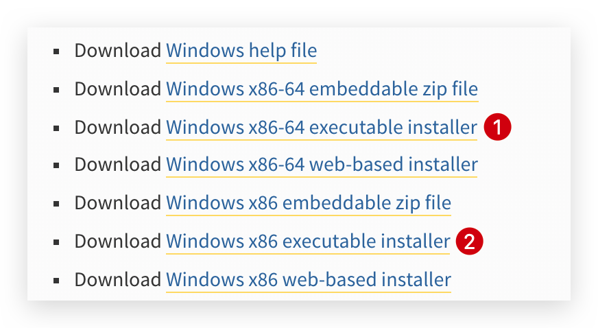
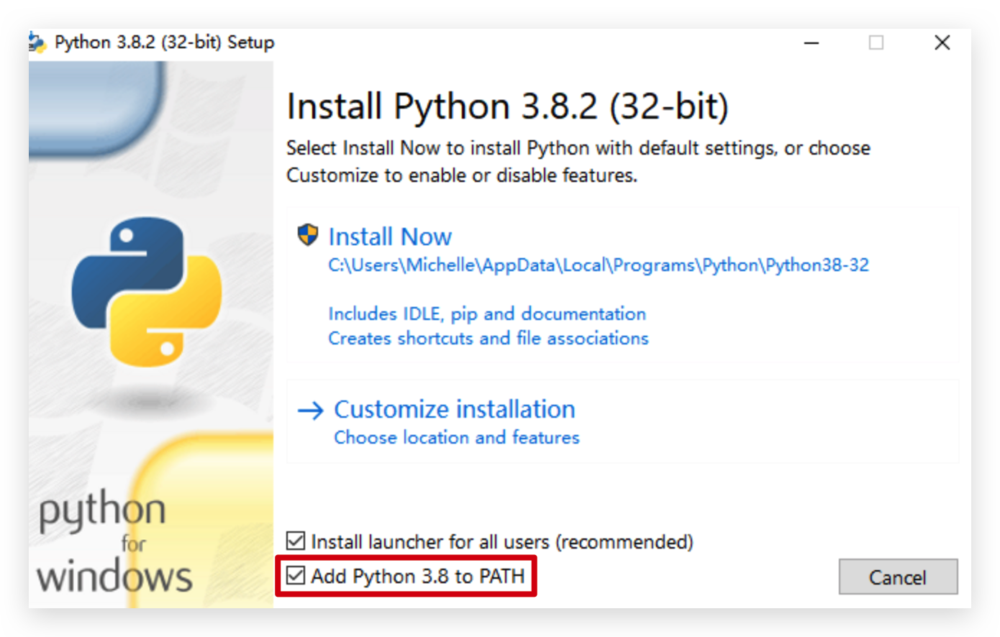
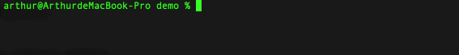
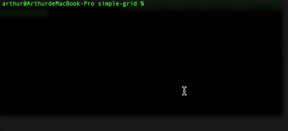
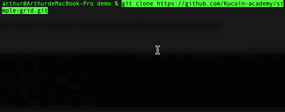

# High-frequency intertemporal arbitrage

[](https://github.com/Kucoin-academy/Guide)
[](https://github.com/Kucoin-academy/simple-grid)
[](https://github.com/Kucoin-academy/simple-grid)
[](https://github.com/Kucoin-academy/simple-grid/issues)

[](README.md)
[](README_CN.md)

## Strategy description

Trading target: BTC  

Source of price spread: BTC Perpetual - BTC Quarterly (omit cointegration test)  

Trading period: 1 minute

Position ratio: 1:1  

Trading type: intertemporal arbitrage

Condition of price spread for longing: If there is no position in current account and price spread < (usual price spread - threshold), long the price spread which means long BTC Perpetual and short BTC Quarterly.  

Condition of price spread for shorting: If there is no position in current account and price spread > (usual price spread + threshold), short the price spread which means short BTC Perpetual and long BTC Quarterly.  

Condition of price spread for closing long position: If there is BTC Perpetual long position and BTC Quarterly short position, while price spread > usual price spread, close the long price spread positions, which means short to close the BTC Perpetual position and long to close the BTC Quarterly position.  

Condition of price spread for closing short position: If there is BTC Perpetual short position and BTC Quarterly long position, while price spread < usual price spread, close the short price spread positions, which means long to close the BTC Perpetual position and short to close the BTC Quarterly position.  

e.g.: If the usual price spread between BTC Perpetual and BTC Quarterly is 35. One day, the price spread rises up to 50, we predict the price spread will go back below to 35 in future. Then we could short BTC Perpetual and long BTC Quarterly to short the price spread - vice versa.  

Notice: The price spread between BTC Perpetual and BTC Quarterly will always return around to 0 (maturity date), so when the price spread is positive, short the price spread in priority, and when the price spread is negative, long the price spread in priority.  


**KuCoin** provides **the transaction data of level 3, great matching engine, and the commission discount specially offers to the API customers**. At the same time, we offer the **sandbox environment** as the data testing support to avoid the risks.

Only a simple and incomplete trading strategy is provided here, so please pay attention to **avoiding risks** when using it. We hope that you can **make test adjustments in the sandbox environment with other parameters or strategies,  as we do not want you to become a philanthropist! ! !**

Surely, if you encounter any problems in this process, or you have a profitable strategy to share, please reflect in **ISSUE**, we will try to respond in a timely manner. 

:point_right: If you are interested in this strategy, please click **the star in the upper right corner**, we will  measure **the popularity of this strategy and subsequent optimization prioritie**s based on the amounts of stars. You can also click **watching in the upper right corner** to continue to follow this project by receiving update notifications. 

## How to use

* Download Python

  * Please download python in [Python](https://www.python.org/) official website for other system requirement(Such as **Windows**), if your computer is 64-bit operating system, please click 1, if it is 32-bit operating system, please click 2.

    

    * Please note the following options when starting the installation:

      

  * For MAC OS X

    * Open terminal and enter the following command to download Homebrew(During the installation, you need to enter the **computer password**):

      ```shell
      /usr/bin/ruby -e "$(curl -fsSL https://raw.githubusercontent.com/Homebrew/install/master/install)"
      ```

    * Enter the following command in terminal to download Python3:

      ```shell
      brew install python
      ```

    * Enter the following command in terminal to confirm if you download successfully:

      ```shell
      python3 --version
      ```

      

* Confirm that you have already downloaded git(Mac OS  already has this software, enther `which git` in terminal to check the path of the file）, if you did not download this software, please do it through the [git](https://git-scm.com/) official website.

* Enter the following command in terminal to install the dependency:

  ```shell script
  pip3 install python-kumex
  ```

  
  
* Create a new folder (such as the desktop) at the location where you need to run the strategy, right click on the newly created folder and select "**Create a new terminal window at the folder location**"(For Windows, right click the folder and select "**git Bash here**"), enter the following command in the pop-up window to clone the project to the local, and a folder **high-frequency** will be added locally after completion:
  
  ```shell
  git clone https://github.com/Kucoin-academy/high-frequency.git
  ```
  
  
  
* Open the (**high-frequency**) project you have cloned,  rename **config.json.example** as **config.json**, using text editor(e.g., **notebook**) to open **config.json**, then add the relevant configuration information: 

  ```
  {  
    "api_key": "api key",
    "api_secret": "api secret",
    "api_passphrase": "api pass phrase",
    //  if sandbox
    "is_sandbox": true,
    // contract name, e.g.: XBTUSDM
    "symbol_a": "contract name",
    // contract name, e.g.: XBTMM20
    "symbol_b": "contract name",
    // usual price spread, good as the average price of the past 3 days price spread  
    "spread_mean": "average closed price for 3 days",
    // price spread threshold, good as 2 times of the standard deviation of the past 3 days price spread
    "num_param": "2 * Standard deviation of spread_mean",
    // leverage, e.g.:5
    "leverage": "Leverage of the order",
    // order size, e.g.: 1
    "size": "Order size. Must be a positive number"
  }
  ```
  
* Mac/Linux open terminal **in the project directory**: 

  ```shell
  cd high-frequency
  ```
  * Using the following command to run your strategy:
  
    ```shell
    ./high_frequency.py
    ```
  
* Windows open terminal **in the project directory**: 

  ```shell
  cd high-frequency
  ```
  * Using the following command to run your strategy:
  
    ```shell
    py high_frequency.py
    ```
  
  

